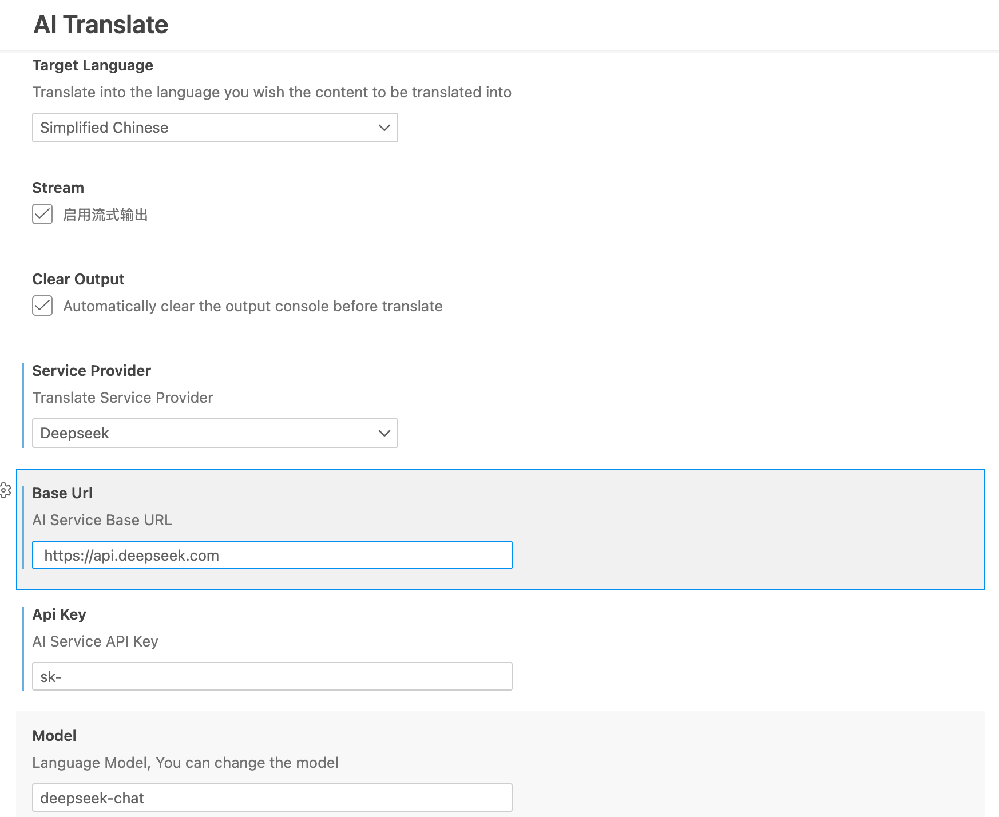

# AI Translate

<div style="text-align: center;">
    
</div>

`ai-translate` 是一款基于大语言模型开发的 VSCode 翻译插件，专为开发者设计，主要用在IDE环境中对英文内容进行翻译。

它的优势是相比传统翻译工具更专业、友好，更加贴合技术背景。

> 如果您使用的是 JetBrains 系列IDE工具，则参考另一个项目 https://github.com/cfanbo/intellij-ai-translate/

## Features

基于AI实现更专业的翻译效果。
例如，这里是一段对 `Raft` 代码的注释
```go
// If s.isLeader() returns true, but we fail to ensure the current
// member's leadership, there are a couple of possibilities:
//   1. current member gets stuck on writing WAL entries;
//   2. current member is in network isolation status;
//   3. current member isn't a leader anymore (possibly due to #1 above).
// In such case, we just return error to client, so that the client can
// switch to another member to continue the lease keep-alive operation.
```
AI翻译效果
```
如果 s.isLeader() 返回 true，但我们未能确保当前成员的领导地位，可能存在几种情况：
1. 当前成员在写入 WAL 日志条目时卡住；
2. 当前成员处于网络隔离状态；
3. 当前成员已不再是领导者（可能是由于上述第 1 点）。
在这种情况下，我们直接向客户端返回错误，以便客户端可以切换到另一个成员继续租约续期操作。
```


## Requirements

翻译功能主要是由LLM来提供，目前支持的服务提供商：

- OpenAI
- Anthropic
- DeepL
- 智谱 GLM
- 豆包
- DeepSeek
- Alibaba
- GitHub
- Gemini


## install Extension

访问 https://marketplace.visualstudio.com/items?itemName=cfanbo.ai-translate 一键安装

## Extension Settings

在 vscode 里需要对  `ai-translate` 进行配置，分别填写到对应的地址



如果选择了其中一个服务提供商，则必须填写对应的配置，否则无法实现翻译功能。未选择的服务商配置可以保留为空。

## Usage Guide
常见的两种使用方法：

## 方法一: 右链菜单
鼠标选择要翻译的注释段落，右链选择菜单`AI 翻译`即可
## 方法二：使用快捷键
- "MacOS": `command+alt+t`
- "Linux": `ctrl+alt+t`
- "Windows": `ctrl+alt+t`


## 反馈意见
如果你在使用插件的过程中遇到任何问题，或发现插件BUG, 或更好的建议，请 [提交反馈](https://github.com/cfanbo/vscode-ai-translate/issues) 给我们。

**Enjoy!**
